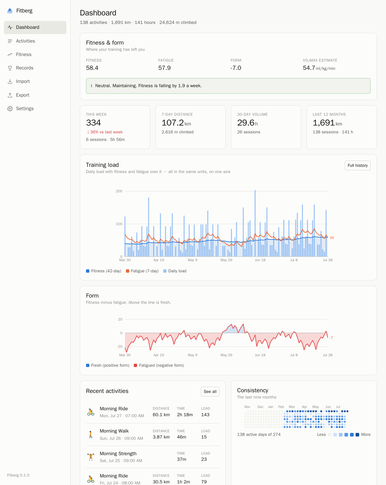
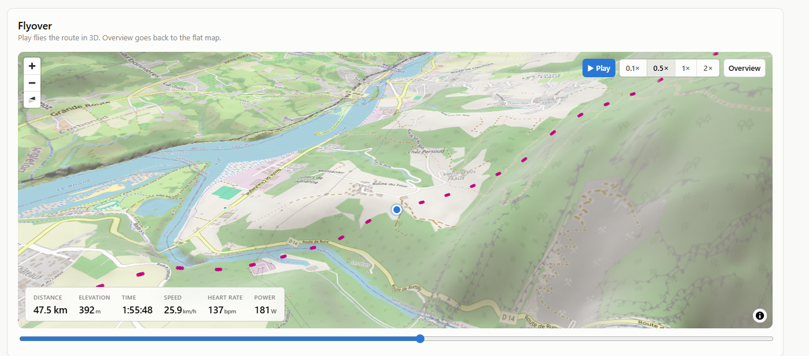
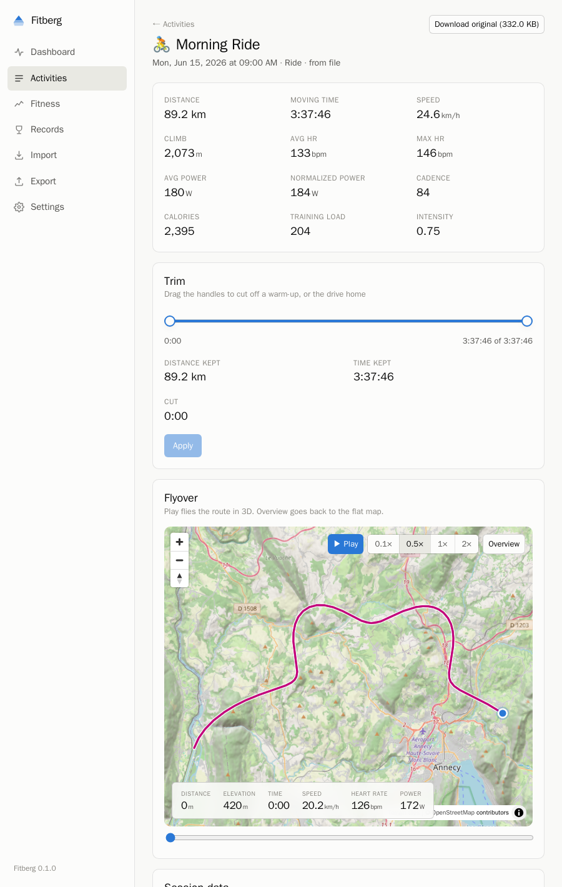
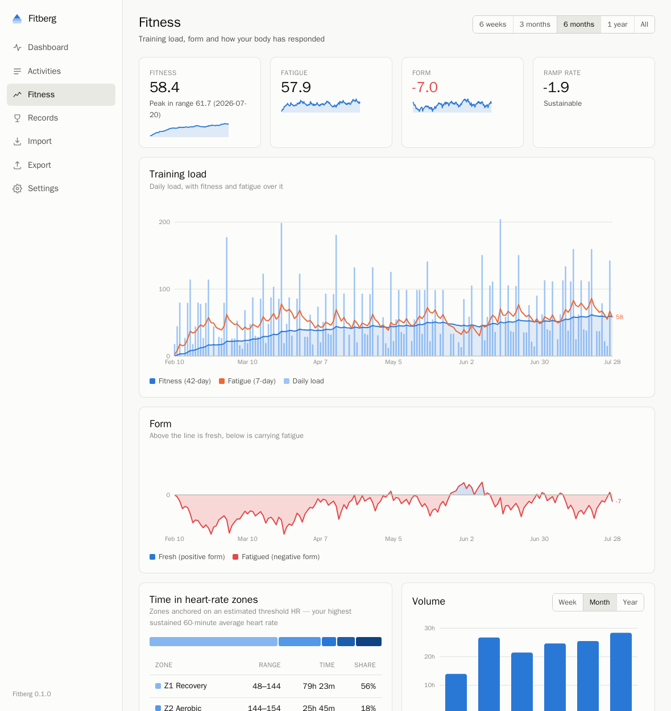
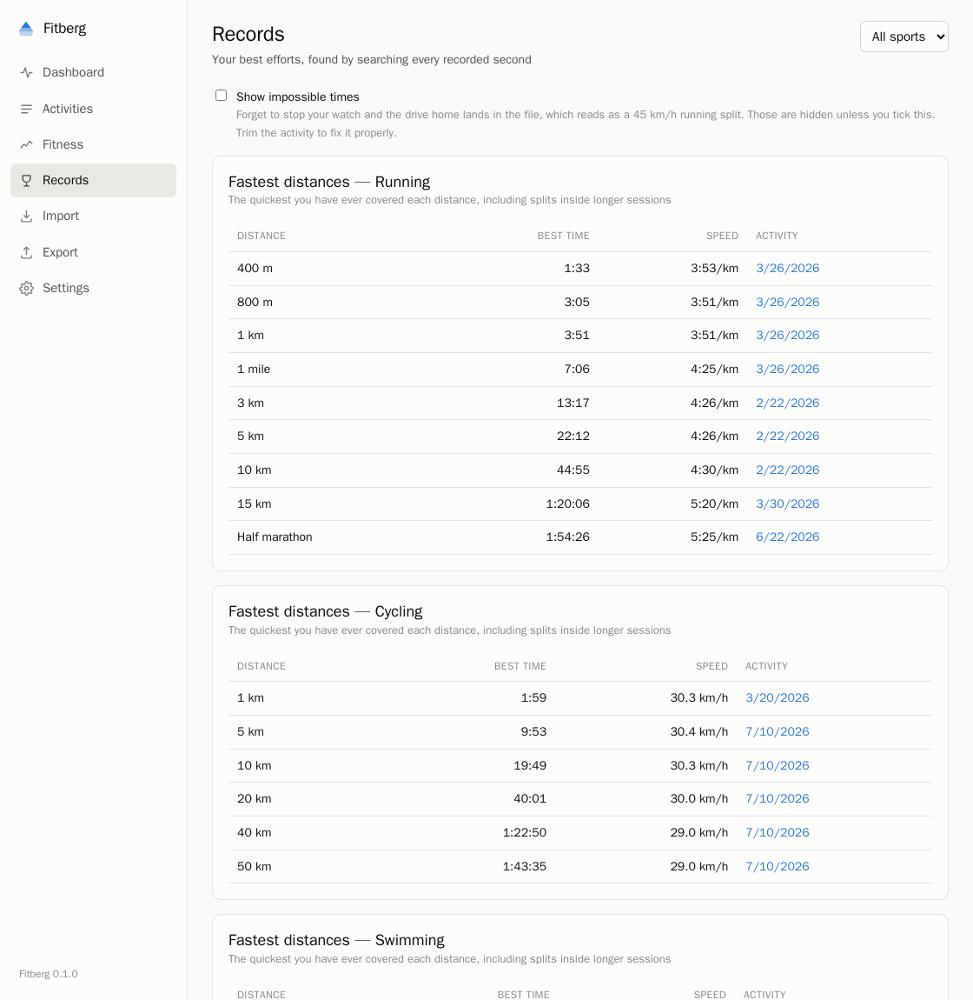

# Fitberg

Self-hosted training log for FIT files. Imports your files, keeps them unmodified, and
derives training load, fitness and form, personal records, power curves, zones and a 3D map
of every route.

Runs in Docker on a home server or a Raspberry Pi. No accounts, no cloud services, no
network calls except map tiles — and COROS sync if you turn it on, which talks to
COROS's own official service on your behalf.



## Features

- **Import** — loose `.fit` files, `.fit.gz`, `.tcx` (Nike Run Club and others), a folder
  from a device, or an unopened export ZIP from another platform. Archives are searched
  recursively; files are identified by content, not extension. Re-importing the same
  data is a no-op.
- **COROS sync** — connect your COROS account once and Fitberg pulls new activities
  through COROS's official MCP service: real FIT files, straight from their servers,
  into the same pipeline as everything else. Runs about once a day while the server is
  up, or on demand from the Import page. COROS caps downloads at 50 activity files
  per day, so a first backfill of a long history takes a few days — it keeps going
  by itself. Off unless you connect an account; disconnecting revokes Fitberg’s
  access at COROS.
- **Training load** from power, heart rate or grade-adjusted pace, whichever the file
  supports, on one scale where an hour at threshold is 100.
- **Fitness and form** — Banister impulse-response: 42-day fitness, 7-day fatigue, form as
  the difference.
- **Records** per sport, scanned across every recorded second, so a fast 5 km inside a long
  run counts. Race distances for running, time-trial distances for cycling, pool events for
  swimming.
- **Mean-maximal power curves**, VO₂max estimates, HR/power/pace zones, aerobic decoupling,
  efficiency factor, monotony and strain.
- **3D flyover** over real elevation, with a HUD and linked charts.
- **Non-destructive trimming** — cut a warm-up or a forgotten stop; totals and averages are
  recomputed, the file is untouched.
- **Export** — one ZIP of your FIT files, readable by any other tool.
- **Optional local AI** via [Ollama](https://ollama.com) for a weekly review and questions
  about your own data.



## Quick start

Requires [Docker](https://docs.docker.com/get-started/get-docker/).

```bash
git clone https://github.com/yonie/fitberg.git
cd fitberg
cp .env.example .env
mkdir -p data
docker compose up -d --build
```

Open <http://localhost:8710>.

Set `SESSION_SECRET` in `.env` to keep sessions across restarts, or
`FITBERG_OPEN_ACCESS=1` to disable the login on a trusted network.

To try it with generated data:

```bash
docker compose exec fitberg npm run seed -- 24
```

## Data and backups

Everything is in `data/`, next to `docker-compose.yml`:

```
data/originals/   your FIT files, unmodified
data/fitberg.db   derived data, rebuildable
```

Back up `data/` and you have a complete copy. The database is disposable — delete it and
rebuild with `reindex`.

To move machines or migrate away, export the ZIP and import it elsewhere.

## Configuration

All values have defaults. See [`.env.example`](.env.example).

| Variable | Purpose |
|---|---|
| `DATA_DIR` | Where files and the database live. Compose pins this to `/data`. |
| `SESSION_SECRET` | Session signing key. Unset means sessions end on restart. |
| `FITBERG_OPEN_ACCESS` | `1` disables authentication. |
| `OLLAMA_URL`, `OLLAMA_MODEL` | AI host and model. Also settable in Settings. |
| `TERRAIN_TILE_URL` | DEM tiles for terrain and hillshading. |
| `MAP_STYLE_URL` | Optional vector basemap, replacing the built-in raster style. |

## Screenshots

| | |
|---|---|
|  |  |
|  | |

## Development

Node 24 or later. No native modules.

```bash
npm run install:all
npm run build
npm start
npm test
```

CLI, prefixed with `docker compose exec fitberg` when containerised:

```bash
npm run fitberg -- status      # what is stored, and current metrics
npm run fitberg -- import ...  # files, a folder, or an export ZIP
npm run fitberg -- verify      # check stored files against their hashes
npm run fitberg -- reindex     # rebuild the database from the FIT files
npm run fitberg -- recompute   # recalculate load and fitness
```

Imported files are content-addressed and read-only; everything else is derived, so schema
changes are applied by adding a column and reindexing. User edits — trims, notes, RPE —
are keyed by an activity's sport, start time and distance so they survive a rebuild.
Storage is SQLite via `node:sqlite`, with sample streams as typed-array blobs.

## Known issues

- In 3D the route is drawn as circles, not a line: MapLibre drapes line layers onto the
  terrain mesh, where the route is hidden. The flat view uses a line.
- MapLibre is pinned to `^5`; 6.0.0 does not render GeoJSON line layers.
- Multi-user is implemented but only tested with one user.

## Licence

[MIT](LICENSE)
